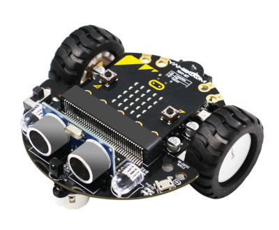

# mimi-ros2-ws

The repository is a ROS 2 workspace containing several included ROS 2 packages.  
This ROS 2 project provides control over the Mimi robot based on a [**micro:bit**](https://microbit.org/) board and the [**Tiny:bit**](https://www.yahboom.net/study/Tiny:bit) mobile platform.  
The micro:bit firmware is also part of the project, but it is located in a [separate repository](https://github.com/robot-mitya/microbit-v2-tinybit).



Development was done on **Linux OS** and **ROS 2 Kilted Kaiju**.  
**CLion** was used as the IDE, so the codebase contains several Bash scripts  
tailored for working with this IDE. These scripts are optional but simplify working with the project:

1. You can launch the IDE using the `open-in-clion.sh` script.  
   It initializes the ROS 2 environment, performs an initial build of the workspace  
   to generate `compile_commands.json`, and launches CLion "the right way".

2. The repository includes a `.run-clion` directory containing  
   CLion "Run/Debug configurations" for building the entire workspace or individual packages.  
   There is also a configuration for building and launching all solution nodes.

## Quick start for development

To prepare the development environment after cloning the repository
(install all dependencies, including Python virtual environments for launch scripts), run:

```bash
./0-dev-install.sh
```

This script:

- initializes the ROS 2 environment
- installs all system dependencies using `rosdep`
- detects Python-based ROS 2 packages in `src/*`
- creates and activates `.venv` for each
- installs each package via `pip install -e .`

Разработка велась в IDE CLion и PyCharm Community.
Запуск CLion следует выполнять из корневой папки воркспейса скриптом `./open-in-clion.sh`.
Чтобы не было конфликтов папок `.idea`, запуск PyCharm следует выполнять из папок Python-пакетов.
Для этого в нём (в них) есть скрипт `./open-in-pycharm.sh`. 

